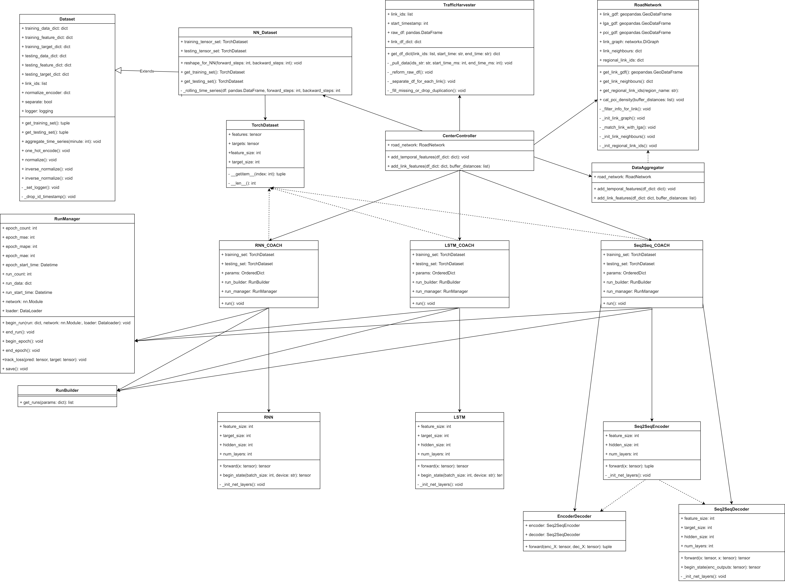

# Table of Content

- [Table of Content](#table-of-content)
- [1. Background](#1-background)
- [2. Install](#2-install)
- [3. Program Structure](#3-program-structure)
- [4. Usage](#4-usage)

# 1. Background

In this project, we request historical travel time data within Vic from ksqlDB, propcess these data for the prediction models and evaluate the results.

# 2. Install

This porject uses Python, Anaconda and PyTorch. Anaconda is a useful package control software. PyTorch is a easily used package to do research in neural network models. Go check them out If you don't have it locally installed.

In anconda terminal, you can input the python environment of this project called VicRoad.yaml.

```conda
conda env create -f VicRoad.yaml
```

Please check whether you have downloaded [PyTorch](https://pytorch.org/). It is noticed that the version of PyTorch is different on the different platform. Also, if you want to use GPU in this project, you should check the whether you have downloaded Nvidia CUDA Compiler (NVCC).

# 3. Program Structure



The more clear figrue is shown in [code_structure.png](picts/code_structure.png).

# 4. Usage
- Firstly, you need to create a directory called log to receive the log file in the program.
- Secondly, please create a directory named key and copy your keys into this file.
- Thirdly, you should confirm the config files in the directory config.
- Then, activate the python environment which have uploaded as VicRoad.yaml.
- Finally, run the python program main.py with argments shown in config.py.
```python
python main.py
```


